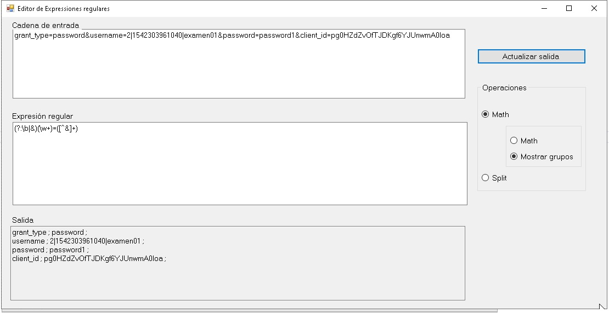

# Ejemplos de manejos de cadenas de texto

### Ejemplo 1
<details>
<summary>Ejemplo sencillo de busqueda de patrones numéricos en una cadena</summary>
</details>

### Ejemplo 2
<details>
<summary>Ejemplo 2</summary>
</details>

### Ejemplo 3
<details open>
<summary>Ejemplo 3</summary>

La aplicación de prueba se muestra en la siguiente figura, permite ir probando expresiones regulares y cadenas de entradas para dichas expresiones ingresadas.
<div align="center">
        
        <p>Figura 1. </p>
</div>

```csharp
  string texto = tbEntrada.Text;
  string patron = tbExpresionRegular.Text;


 if (rbMath.Checked == true)
 {
    Match m = Regex.Match(texto, patron);
    if (rbMatches.Checked == true)
    {
      if (m.Success == false)
        tbSalida.Text = "no hay coincidencia para: " + texto;

        while (m.Success)
        {
          tbSalida.Text += $"{m.ToString(),20}:{m.Index,10}\n";
          m = m.NextMatch();
        }
    }
    if (rbGroups.Checked == true)
    {
      if (m.Success == false)
        tbSalida.Text = "no hay grupos";

      while (m.Success)
      {
        for (int n = 1; n < m.Groups.Count; n++)
          tbSalida.Text += m.Groups[n].Value + " ; ";
     
        tbSalida.Text += "\r\n";
        m = m.NextMatch();
      }
    }
  }
  else if (rbSplit.Checked == true)
  {
    string[] lista = Regex.Split(texto, patron);
    foreach (string campo in lista)
      tbSalida.Text += campo + "\r\n";
  }
}
```

</details>
